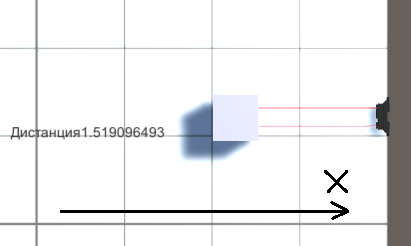

# unity
# Поянительная записка к проектной работе
## на тему:  Программный комплекс ИК датчика SHARP-GP2Y0A02YK0F  
Выполнил:
Третьяк М.К.


### Содержание:

 1. Описание модели датчика
 
       1.1 Технические характеристики датчика 

       1.2 Описание работы датчика
    
       1.3 Описание объектов сцены в среде Unity
     
       1.4 Описание возможностей модели датчика
    

 2. Список используемой литературы 
 
 
 ### 1. Описание модели датчика

##### 1.1 Технические характеристики датчика
1. Диапазон измерения расстояния: от 20 до 150 см
2. Аналоговый выход
3. Размеры: 29.5x13x21.6 мм
4. Потребление тока: 33 мА
5. Напряжение питания: от 4.5 до 5.5 В

##### 1.2 Описание работы датчика


Принцип работы

Расстояние до объекта сенсоры определяют при помощи триангуляции.
Импульс света (в ИК диапазоне: длина волны 850нм ± 70нм), излучается и отражается обратно от препятствия (или не отражается). Угол падения возвращаемого светового луча зависит от расстояния до отражающего объекта. 
Триангуляция работает путём обнаружения этого отражённого луча и определения угла отражения, из которого уже может быть определено расстояние.


Датчик имеет специальный ИК-объектив, который принимает отражённый ИК-луч на специальную ПЗС-матрицу (CCD array). На основе данных ПЗС-матрицы, определяется угол отражения, который затем используется для рассчёта дальности. 
Соответствующее значение дальности подаётся на аналоговый выход сенсора, которое может быть считано нашим микроконтроллером. 

Для избавления от возможных помех, сенсоры SHARP излучают ИК-сигнал с модулированной частотой. Это позволяет практически полностью застраховаться от помех от окружающего света.
Кроме того, датчики показывают почти полное безразличие к цвету объекта обнаружения (датчик способен обнаруживать чёрные стены при солнечном свете).

Подключается сенсор при помощи 3-пинового разъёма:
Vo, GND, Vcc
 


Применение

1. Безконтактный переключатель (сантехника, управление освещением и т.п.)
2. Датчик экономии энергии (ATM, копиры, вендинговые машины, ноутбуки, LCD-мониторы)
3. Развлекательное оборудование (роботы, аркадные игровые автоматы)

Ограничения

Поскольку в основе работы устройства используется свет, сенсор плохо подходит для определения расстояния до светопоглощающих объектов. Дальномер даже не почувствует прозрачную поверхность, например из пластика или оргстекла.
Этот инфракрасный дальномер имеет довольно большую мёртвую зону перед собой: 20 см.

##### 1.3 Описание объектов сцены в среде Unity

Сцена содержит камеру (вид сверху).

Создана поверхность с разметкой, одна клетка принята за 1 ед. Unity = 100 см. Маштаб датчика увеличен для наглядности. Размещены объекты 3D Text для отображения расстояния от датчика до объекта в метрах.



Создано 2 скрипта:

1. move.cs
2. Script.cs
3. NewTestScript.cs TestScript.cs

* Скрипт 1 отвечает за передвижение объекта(куба) по оси X.
* Скрипт 2 выполняет расчет дистанции в диапазоне 150см-20см.
* Скрипт 3 тесты

##### 1.4 Описание возможностей модели датчика

В разработанной модели реализованы следующие функции:

* Невозможность считывания расстояния меньше 20 см и отображение расстояния >150 см
* Расчёт и отображение расстояния до ближайшего объекта, вошедшего  рабочую зону

### 2. Описание интерфейса

1. Управление объектом (кубом) осуществляется с помощью клавиш W/S (движение вперед/назад) по оси координат X
2. В левой части отображается расстояние от датчика до объектах в пределах (150-20 см)

### 3. Описание тестов

Всего было проведено 3 теста для расстояний более 150 см (вне зоны считывания датчика), 150-20 см (в зоне считывания датчика) и до 20 см (в мертвой зоне датчика).


```
public IEnumerator TestScript()
    {
        var datchik_prefab = AssetDatabase.LoadAssetAtPath<GameObject>("Assets/Prefab/datchiktest.prefab");
        var cube_prefab = AssetDatabase.LoadAssetAtPath<GameObject>("Assets/Prefab/Cubetest.prefab");
        var sensor = GameObject.Instantiate(
            datchik_prefab,
            new Vector3(-2, 0, 0),
            new Quaternion(0, 0, 0, 0)
            );

        var cube = GameObject.Instantiate(
           cube_prefab,
           new Vector3(0, 0, 0),
           new Quaternion(0, 0, 0, 0)
           );
        var datchik = sensor.gameObject.GetComponentInChildren<TestScript>();
        var NewDist = datchik.dist;
        Assert.AreNotEqual(new Vector3(0, 0, 0), datchik.IK.position);
        Debug.Log("Distanse: " + datchik.dist + " | BOLSHE 150 CM");
        while (datchik.dist == NewDist)
        {
            yield return null;
        }
    }
```    

```
 public IEnumerator TestScript1() {
        var datchik_prefab = AssetDatabase.LoadAssetAtPath<GameObject>("Assets/Prefab/datchiktest.prefab");
        var cube_prefab = AssetDatabase.LoadAssetAtPath<GameObject>("Assets/Prefab/Cubetest.prefab");
        var sensor = GameObject.Instantiate(
            datchik_prefab,
            new Vector3(-1, 0, 0),
            new Quaternion(0, 0, 0, 0)
            );

        var cube = GameObject.Instantiate(
           cube_prefab,
           new Vector3(0, 0, 0),
           new Quaternion(0, 0, 0, 0)
           );
        var datchik = sensor.gameObject.GetComponentInChildren<TestScript>();
        var NewDist = datchik.dist;
        while (datchik.dist == NewDist)
        {
            yield return null;
        }
        Assert.AreNotEqual(new Vector3(0, 0, 0), datchik.IK.position);          
        Assert.AreNotEqual(0F, datchik.dist);                                  
        Debug.Log("Distanse: " + datchik.dist + " | OT 150 DO 20 CM");
    }
```    

```
 public IEnumerator TestScript2()
    {
        var datchik_prefab = AssetDatabase.LoadAssetAtPath<GameObject>("Assets/Prefab/datchiktest.prefab");
        var cube_prefab = AssetDatabase.LoadAssetAtPath<GameObject>("Assets/Prefab/Cubetest.prefab");
        var sensor = GameObject.Instantiate(
            datchik_prefab,
            new Vector3(0, 0, 0),
            new Quaternion(0, 0, 0, 0)
            );

        var cube = GameObject.Instantiate(
           cube_prefab,
           new Vector3(0, 0, 0),
           new Quaternion(0, 0, 0, 0)
           );
        var datchik = sensor.gameObject.GetComponentInChildren<TestScript>();
        var NewDist = datchik.dist;
        Debug.Log("Distanse: " + datchik.dist + " | DO 20 CM");
        while (datchik.dist == NewDist)
        {
            yield return null;
        }
    }
```


### 4. Список используемых источников
1. Андреев В.П. Лекции по курсу: "Сенсорные и управляющие системы роботов"
2. Краткое руководство по Маркдауну URL: https://paulradzkov.com/2014/markdown_cheatsheet/  
3. Руководство Unity URL: https://docs.unity3d.com/ru/530/Manual/UnityManual.html  
4. Pro GIT URL: https://git-scm.com/book/ru/v1
5. VisualStudio С# - help// справочная информация по С#
